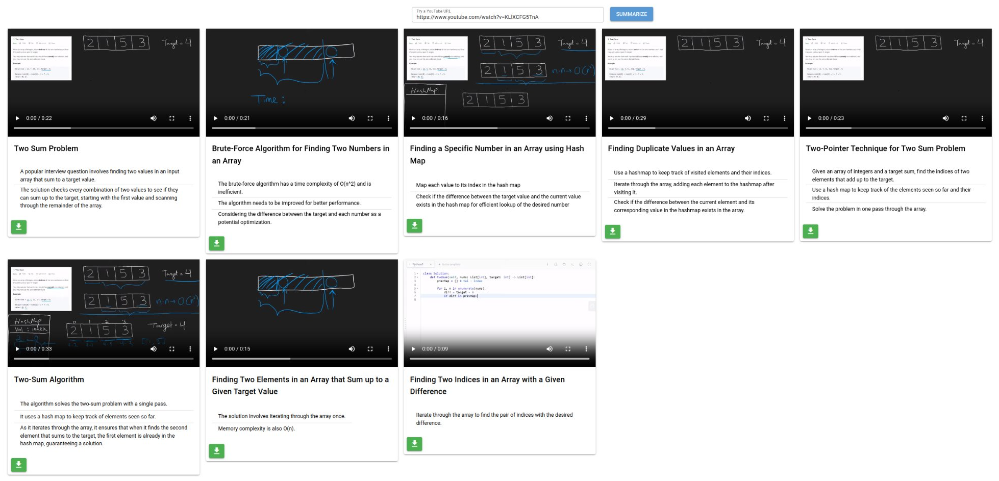
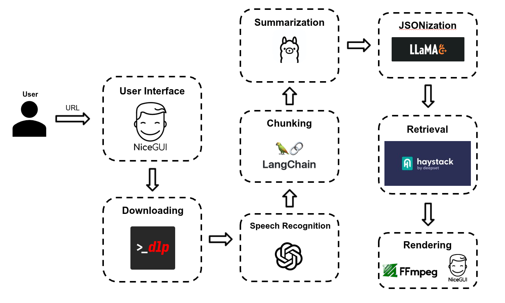

# VideoCarder

> Turn any YouTube video with speech into evidence-based summary cards - each bullet point backed by the exact clip that supports it.

---



---

## About

VideoCarder is a fully local, AI-powered pipeline that takes a YouTube URL and produces a set of _VideoCards_ - structured summary cards based on the speech uttered, where every bullet point is accompanied by a trimmed video clip of the source moment in the video. Rather than generating a summary you have to trust, VideoCarder retrieves and surfaces the exact segments of the original video that support each point, letting you verify claims at a glance.

---

## Pipeline

<!-- PLACEHOLDER: Replace with a simplified pipeline flow diagram -->


```
YouTube URL
  ↓  yt-dlp
Audio + Video Download
  ↓  stable-whisper
Timestamped Transcript
  ↓  LangChain
Text Chunks
  ↓  Ollama (llama3:instruct) + llama-cpp (Llama-3 8B)
Summaries + Bullet Points (JSON)
  ↓  Haystack RAG Pipeline
         sentence-transformers  ─┐
         BM25                   ─┤→ RRF Fusion → Re-ranking
         BAAI/bge-reranker-base ─┘
Relevant Segments per Bullet
  ↓  ffmpeg
Trimmed & Merged Video Clips
  ↓  NiceGUI
Interactive VideoCards
```

---

## Features

- **Fully local**: all models run on your machine; no cloud API keys required
- **Evidence-backed summaries**: every bullet links to the actual video moment
- **Hybrid retrieval**: dense embedding + BM25 search fused with Reciprocal Rank Fusion for robust segment matching
- **Temporal re-ranking**: retrieved segments are ordered chronologically within each card
- **Deduplication**: the same video segment is never used in more than one card

---

## Tech Stack

| Category | Technology |
|---|---|
| **Transcription** | [stable-whisper](https://github.com/jianfch/stable-ts) (OpenAI Whisper with word-level timestamps) |
| **Summarization** | [Ollama](https://ollama.com/) (`llama3:instruct`), [llama-cpp-python](https://github.com/abetlen/llama-cpp-python) (Meta-Llama-3-8B-Instruct Q6_K GGUF) |
| **Text Splitting** | [LangChain](https://github.com/langchain-ai/langchain) `RecursiveCharacterTextSplitter` |
| **RAG Pipeline** | [Haystack](https://haystack.deepset.ai/) — document store, hybrid retrievers, RRF joiner, re-ranker, sampler |
| **Embeddings** | [sentence-transformers](https://www.sbert.net/) (`all-mpnet-base-v2`) |
| **Re-ranking** | `BAAI/bge-reranker-base` |
| **Video / Audio** | [yt-dlp](https://github.com/yt-dlp/yt-dlp), [ffmpeg-python](https://github.com/kkroening/ffmpeg-python) |
| **Web UI** | [NiceGUI](https://nicegui.io/) |
| **REST API** | [FastAPI](https://fastapi.tiangolo.com/) + [Pydantic](https://docs.pydantic.dev/) |

---

## Project Structure

```
VideoCarder/
├── gui.py                  # NiceGUI web application (main entry point)
├── api/
│   ├── app.py              # FastAPI REST endpoint
│   ├── models.py           # Pydantic data models
│   ├── src/
│   │   ├── downloading.py       # yt-dlp audio/video download
│   │   ├── speech_recognition.py# Whisper transcription + segment preprocessing
│   │   ├── chunking.py          # LangChain text splitting
│   │   ├── summarization.py     # Ollama + llama-cpp summarization & bullet generation
│   │   ├── retrieval.py         # Haystack pipeline: embed → retrieve → fuse → rerank
│   │   ├── trimming.py          # FFmpeg video trimming & merging
│   │   └── file_utils.py        # Directory cleanup helpers
│   └── static/             # Runtime media storage (audio, video, trims, merged)
├── modelfiles/
│   └── llama3_instruct_podcast_chunk_summarizer  # Custom Ollama modelfile
└── notebooks/              # Exploratory notebooks for each pipeline stage
```

---

## Quickstart

### Prerequisites

1. **uv** - install from [docs.astral.sh/uv](https://docs.astral.sh/uv/getting-started/installation/) (it will manage the Python version automatically):
   ```bash
   curl -LsSf https://astral.sh/uv/install.sh | sh
   ```

2. **FFmpeg** - install via your package manager:
   ```bash
   # Ubuntu / Debian
   sudo apt install ffmpeg

   # macOS
   brew install ffmpeg
   ```

3. **Ollama** - install from [ollama.com](https://ollama.com/) and pull the required model:
   ```bash
   ollama pull llama3:instruct
   ```
   Then create the custom summarizer model:
   ```bash
   ollama create llama3_instruct_podcast_chunk_summarizer -f modelfiles/llama3_instruct_podcast_chunk_summarizer
   ```

4. **GGUF model** - download `Meta-Llama-3-8B-Instruct.Q6_K.gguf` (or equivalent) and update the path in `api/src/summarization.py`:
   ```python
   GGUF_MODEL_PATH = "/path/to/your/Meta-Llama-3-8B-Instruct.Q6_K.gguf"
   ```

### Installation

```bash
git clone https://github.com/jobini/VideoCarder.git
cd VideoCarder
uv sync
```

### Run the Web UI

```bash
uv run python gui.py
```

Open your browser at `http://localhost:8080`, paste a YouTube URL, and click **Summarize**.

### Run the API Server

```bash
uv run uvicorn api.app:app --reload
```

---

## Configuration

A few paths are currently hardcoded and should be updated before running:

| Setting | File | Default |
|---|---|---|
| GGUF model path | `api/src/summarization.py` | `/home/.../Meta-Llama-3-8B-Instruct.Q6_K.gguf` |
| Static media directory | `api/app.py` | `api/static/` |
| Whisper model size | `api/src/speech_recognition.py` | `"tiny"` (options: `small`, `medium`, `large`) |

---

## License

The VideoCarder source code is released under the [MIT License](LICENSE).

### Third-Party Licenses

This project depends on components with their own licenses. Notable ones:

| Component | License | Link |
|---|---|---|
| Meta-Llama-3-8B-Instruct (GGUF model) | Meta Llama 3 Community License | [Details](https://llama.meta.com/llama3/license/) |
| Haystack | Apache 2.0 | [Details](https://github.com/deepset-ai/haystack/blob/main/LICENSE) |
| sentence-transformers | Apache 2.0 | [Details](https://github.com/UKPLab/sentence-transformers/blob/master/LICENSE) |
| FFmpeg | LGPL 2.1+ | [Details](https://ffmpeg.org/legal.html) |
